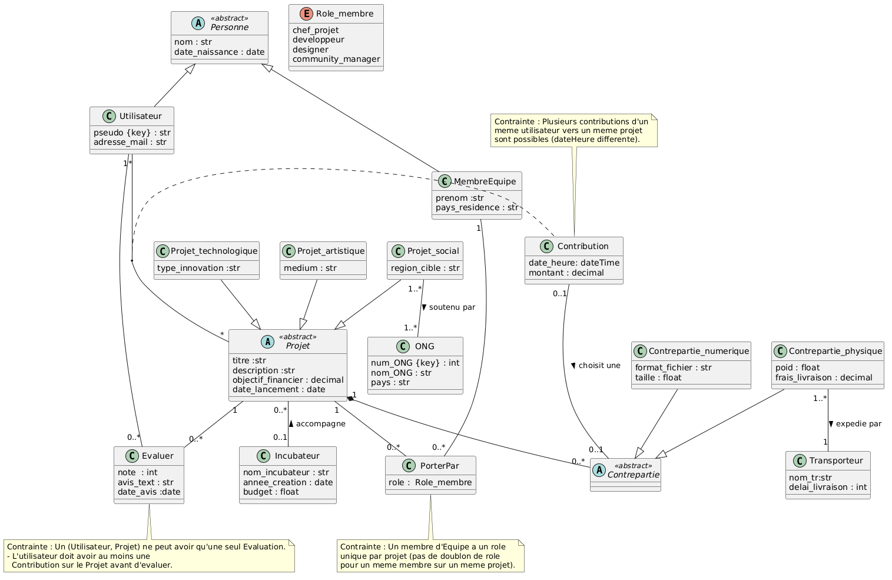
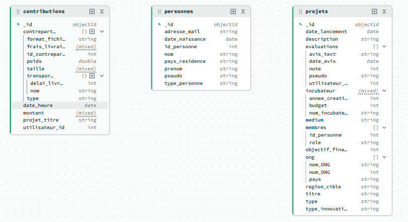

# Note de Clarification

**Plateforme CrowdFundr – Financement participatif** 

---
## Utilisation de l'IA
| Rendu   | oui/non                                  | prompt      | 
|---------|------------------------------------------|-------------|
| NDC+MCD |oui   |pour comparer le travaille
| NDC     |oui   |Rappelle des sections obligatoires d'une Note de Clarification en base de données.
| MCD     |oui   |Quels sont les erreurs classiques d'un diagramme de classes UML pour un débutant ?
| MCD     |oui   |Comment on note une contrainte qui n'est pas représentable directement en UML (ex: 'un utilisateur ne peut noter qu'après avoir contribué).
| MCD     |oui   |Comment décider si une information doit être un attribut ou une classe à part entière en UML ?
| MCD     |oui   |Je veux vérifier mon diagramme UML. Quels points contrôler absolument avant de le rendre ?
| MLD1    |non|aucune utilisation
|SQL |oui|INSERT : J'ai besoin d'insérer des données (environ 15 lignes pas table) dans ma base de donées. Ces donées doivent également pouvoir répondre à ces questions (les besoins). Peux tu me fournir cela?
|SQL|oui|trigger : Representation des contraintes complexe sur les heritages et associations en SQL à travers les triggers
|SQL|oui|debbugage des requetes 1 et 2 pour les besoins : "cette requete est elle juste SELECT"+la requete  en question a permis de trouver des erreurs d'inattention comme l'oubli de précisé la table en question pour un attribut, de mettre tous les éléments dans le group by 
|Applicatif|oui|Pour la gestion des erreur : try - except dans toutes les fonction python qu'on a implementer.
|JSON-Rélationnel|oui|Q1:Pour savoir si le nouveau modèle conceptuel R-Json doit etre different du premier MCD relationnel, si oui, alors doit t'on afficher les attribut du type JSON sur le nouveau MCD ou dans le MLD ?
|MongoDB|oui|Géneration des donnée coherente pour inserer dans la coolection projet afin de pour y appliquer les 3 requètes complexes, modification de notre premier application et la gestion des erreur.
|MongoDB|oui|Géneration des donnée coherente pour inserer dans les 3 nouvelle collections projet, personnes et contribution afin de pour y appliquer les 3 requètes complexes, modification de notre premier application et la gestion des erreur.
|Application MongoDB|oui| correction et gestion des erreur et assistance dans l'implementation des fonction de requète complexe

## Repartition du travail
Contribution égale pour chaque membre du groupe.

## 1. Classes principales

| Objet           | Description                                   |
|-----------------|-----------------------------------------------|
| Projet          | Projet de financement participatif            |
| Membre_equipe    | Personne participant à un projet              |
| Incubateur      | Structure accompagnant un projet              |
| ONG             | Organisation soutenant un projet social       |
| Utilisateur     | Personne contribuant financièrement           |
| Contribution    | Versement d’un utilisateur à un projet        |
| Contrepartie    | Récompense offerte       |
| Transporteur    | Partenaire logistique pour contreparties      |
| Evaluer            | Évaluation (note + texte) d’un projet         |

---

## 2. Propriétés associées à chaque objet

###  Projet (classe mère et fille)

| Objet / classe fille     | Propriété                                      | Type / Contrainte                       | 
|------------------------|------------------------------------------------|------------------------------------------|
| Projet (mère)| titre, description, objectif_financier, date_lancement | Texte, texte, décimal, date        |
| ProjetTechnologique  (fille)  | typeInnovation                                 | Texte                 |
| ProjetArtistique   (fille)    | medium                               | str (peinture, musique...)             |
| ProjetSocial     (fille)      | region_cible                                    | Texte                                  |
---

### MembreEquipe & Incubateur

| Objet      | Propriétés                                                                                                        |
|------------|-------------------------------------------------------------------------------------------------------------------|
| Membre     | nom, prenom, pays_residence, date_naissanceM, Role_membre (chef_projet,community_manager, developpeur, designer ) |
| Incubateur | nom, annee_creation, budget                                                                                       |

---

## ONG & Utilisateur

| Objet       | Propriétés                                               | Contrainte |
|-------------|----------------------------------------------------------|------------|
| ONG         | num_ONG (key), nom, pays                                 | clé        |
| Utilisateur | pseudo unique, adresse_mail unique, nom, date_naissanceU | pseudo key |

---

###  Contribution & Contreparties (classe mère)

| Objet                 | Propriétés clés                               | Spécificité |
|-----------------------|-----------------------------------------------|-------------|
| Contribution         | dateHeure, montant (>0), | Plusieurs contributions par projet/utilisateur (clé = dateHeure) |
| Contrepartie_numerique (fille)| formatFichier, taille                      | string, positive        |
| Contrepartie_physique (fille) | poids, frais_livraison,    | Un seul transporteur par contrepartie |
| Transporteur          | nom_tr, delai_livraison (jours)             | string, positive      |

---

###  Evaluer

| Propriété     | Type / Règle |
|---------------|--------------|
| note (1 à 5)  | Un seul avis par (Utilisateur, Projet). Nécessite une contribution préalable. |
| avis_text  | Texte        |
| date_avis      | Date         |

---

## 3. Contraintes essentielles

- **C1** : Un projet a 1 ou plusieurs membres. Un membre peut être dans plusieurs projets.
- **C2** – Un membre a un seul rôle par projet (ex: il est soit développeur, soit chef).
- **C3** – Un projet a un seul type (techno OU artistique OU social, pas deux à la fois). heritage exclusif
- **C4** – Un projet social peut être soutenu par plusieurs ONG. Une ONG peut soutenir plusieurs projets sociaux.
- **C5** – Un utilisateur peut contribuer plusieurs fois au même projet (grâce à date+heure qui sera notre cle local ici).
- **C6** – Un utilisateur ne peut laisser qu'un seul avis par projet.
- **C7** – Pour noter un projet, il faut avoir déjà contribué au moins une fois à ce projet.
- **C8** – Une contrepartie physique est livrée par un seul transporteur.

## 4. Hypothèses :
-  Un projet peut n'avoir aucune contribution. Par exemple, si le  projet vient d'être mis en place, les contributions pourront commencer après la mise en place du projet(Date-heure de contribution > Date-heure de creation du projet)
- Un projet social peut être officiellement soutenu par une ou plusieurs ONG => un projet social  doit avoir au moins une ONG qui l'a soutient, car comme son nom le dit, c'est un projet social
- Une contrepartie ne peut pas exister sans contribution 
- Un utilisateur peut ou peut ne pas évaluer un projet. L'évaluation n'est pas  obligatoire
- Un projet peut ne pas être évalué
- Un incubateur peut accompagner 0 ou plusieurs projets
- Un transporteur peut n'avoir transporté aucune contrepartie
- Un utilisateur peut contribuer à plusieurs projets
- Un utilisateur peut contribuer plusieurs fois au même projet

## 5. Pour le MCD
- Les attributs sont NOT NULL par défaut.
- L'héritage est exclusif.

## Diagramme UML relationnel (version finale, MCD v2)

## Diagramme MongoDB

